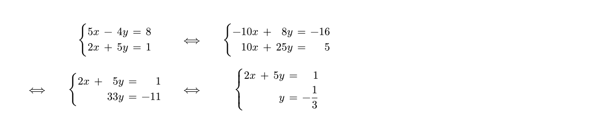
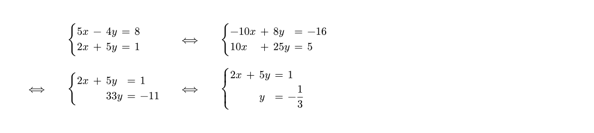
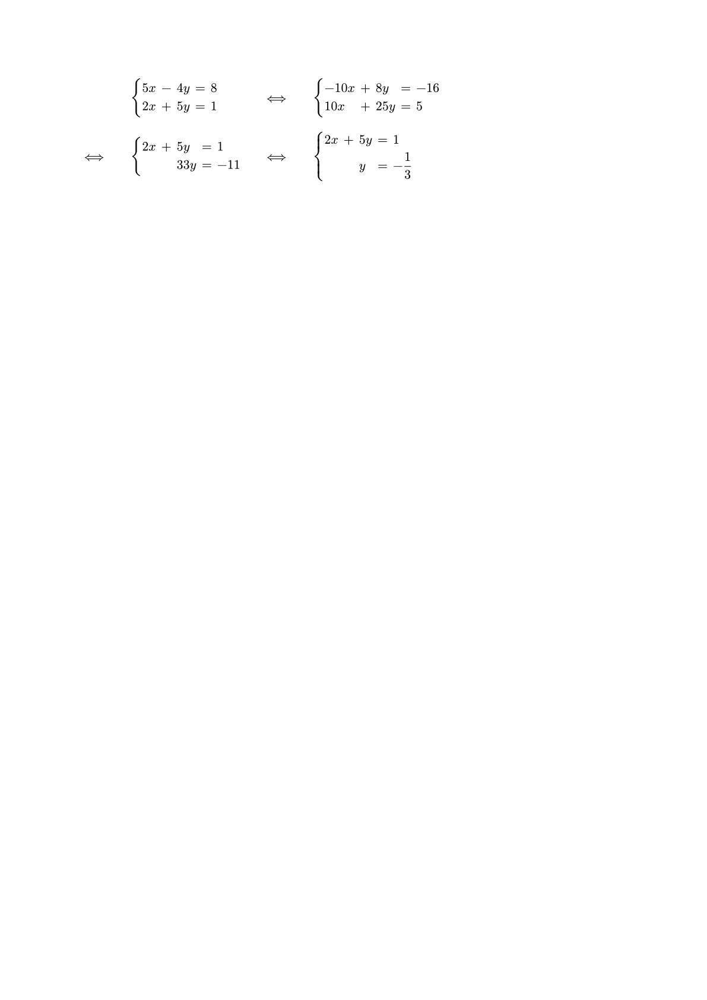
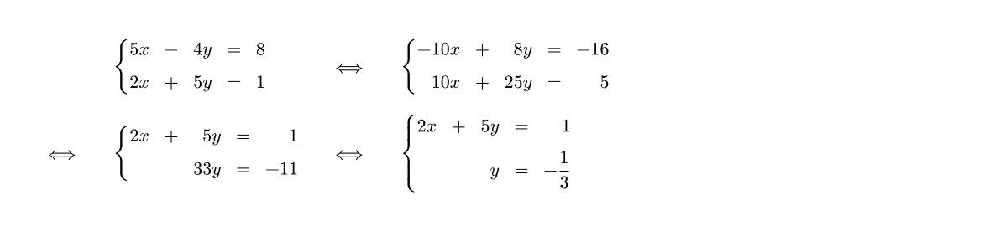
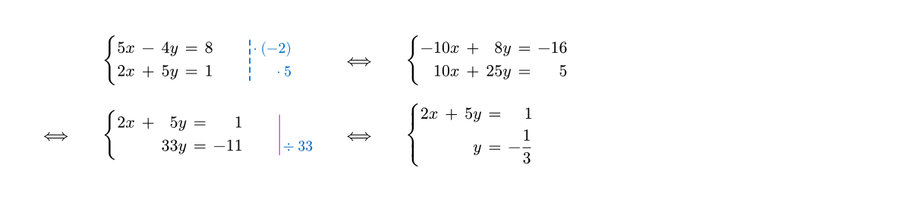
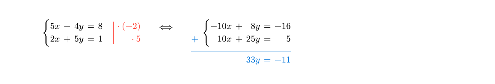
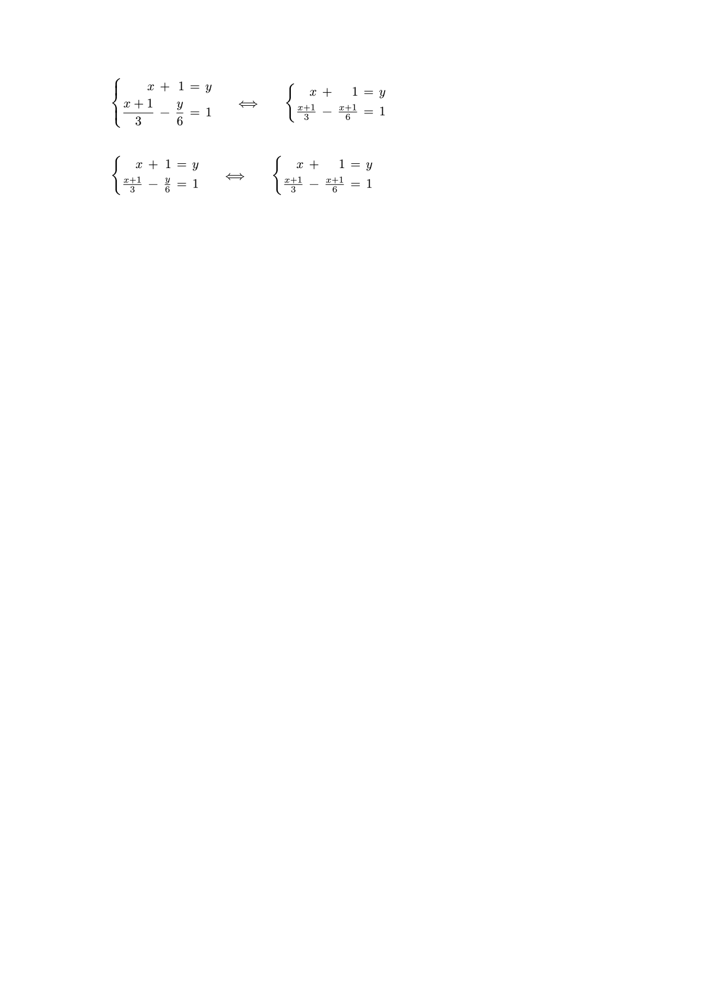
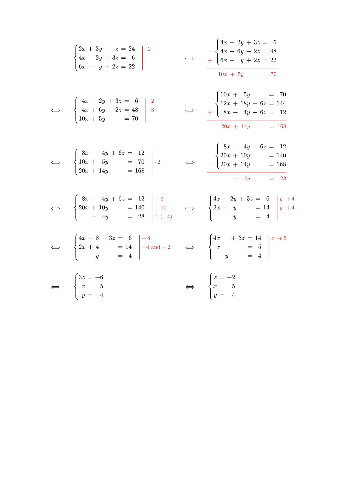

# systeq

systeq is a Typst package for formatting system of equations. Take a look at the [manual](https://github.com/Yesteeer/typst-systeq/blob/master/docs/manual.pdf?raw=true) for more examples.

## Quickstart
Simply download the package locally (as described on the [Typst Packages](https://github.com/typst/packages)) repository. Then import and use systeq. 

```typst
#import "@local/systeq:0.1.0": *
```

## Functions
systeq comes with two functions: `systeq` and `render-systeq`. The former defines one system of equations, while the latter renders one or multiple systems. You always need to render a system.

## Syntax

We can render a simple system (like `math.cases`) which is `inline` by default.
```typst
#import "@local/systeq:0.1.0": *

#set page(height: auto, margin: 1cm)

This is a simple 2x2 linear system: 
#render-systeq(systeq($5x - 4y = 8$, $2x + 5y = 1$))
```


Simply put it between \$ ... \$ to make it into a `block`.

The function `sys` represents a system, which needs to be rendered via `render-sys`. Multiple systems can be rendered at once and will be rendered in a `grid` with default symbol `sep-symbol: $<==>$` and default column number `columns: 4` (counting separators).

```typst
[...]

#render-systeq(
    systeq($5x - 4y = 8$, $2x + 5y = 1$),
    systeq($-10x + 8y = -16$, $10x + 25y = 5$),
    systeq($2x + 5y = 1$, $"" "" 33y = -11$),
    systeq($2x + 5y = 1$, $"" "" y = -1/3$),
)
```


Usual alignment operator `&` cannot be used in `sys`. You should use spaces to create the alignment points instead and empty strings `""` to get empty placeholders.

## Alignments

Alignments can be customized at different levels. First we can change the alignment inside the grid (default: `align: horizon`).
```typst
[...]

#render-systeq(
    align: center + horizon,
    systeq($5x - 4y = 8$, $2x + 5y = 1$),
    systeq($-10x + 8y = -16$, $10x + 25y = 5$),
    systeq($2x + 5y = 1$, $"" "" 33y = -11$),
    systeq($2x + 5y = 1$, $"" "" y = -1/3$),
)
```


You can also change the alignment inside the systems (default: `align: right`).
```typst
[...]

#render-systeq(
    sys-align: left,
    systeq($5x - 4y = 8$, $2x + 5y = 1$),
    systeq($-10x + 8y = -16$, $10x + 25y = 5$),
    systeq($2x + 5y = 1$, $"" "" 33y = -11$),
    systeq($2x + 5y = 1$, $"" "" y = -1/3$),
)
```


## Spacing

You can customize the grid gutters with defaults `column-gutter: 2em` and `row-gutter: 2em`.
```typst
[...]

#render-systeq(
    column-gutter: 4em,
    systeq($5x - 4y = 8$, $2x + 5y = 1$),
    systeq($-10x + 8y = -16$, $10x + 25y = 5$),
    systeq($2x + 5y = 1$, $"" "" 33y = -11$),
    systeq($2x + 5y = 1$, $"" "" y = -1/3$),
)
```


You can customize the spacing inside the system with defaults `sys-col-gap: .4em` and `sys-row-gap: .4em`.
```typst
[...]

#render-systeq(
    sys-col-gap: 1em,
    systeq($5x - 4y = 8$, $2x + 5y = 1$),
    systeq($-10x + 8y = -16$, $10x + 25y = 5$),
    systeq($2x + 5y = 1$, $"" "" 33y = -11$),
    systeq($2x + 5y = 1$, $"" "" y = -1/3$),
)
```


## Annotations

You can annotate each equation of a system using the `annot` parameter of `sys`.

The annotation color, size, offset and bar stroke can be changed with following defaults `annot-color: red`, `annot-size: 1em`, `annot-spacing: (left: 1em, right: .2em)` and `annot-bar: (paint: annot-color, thickness: .8pt, dash: "solid")`. The latter accepts any stroke as argument and the `annot-bar` is removed when set to `none`. Each of these parameters can be passed to `render-sys` to be applied to every underlying system and can individually be overridden by passing them to `sys`.
```typst
[...]

#render-systeq(
    annot-color: blue.darken(10%),
    annot-size: .9em,
    annot-spacing: (left: 2em, right: 0em),
    annot-bar: (dash: "dashed"),
    systeq($5x - 4y = 8$, $2x + 5y = 1$, annot: ($dot (-2)$, $dot 5$)),
    systeq($-10x + 8y = -16$, $10x + 25y = 5$),
    systeq($2x + 5y = 1$, $"" "" 33y = -11$, annot: ("",$div 33$), annot-bar: purple),
    systeq($2x + 5y = 1$, $"" "" y = -1/3$),
)
```



## Addition and substractions modes

One last feature of the _systeq_ package is to display addition or substraction operations between equations of one system. This can be used by changing the systems `mode` with default `mode: "normal"` to `mode: "add"` or `mode: "sub"`. This uses the last `sys` entry as result of the addition / substraction and adds a $+$ or $-$ sign on the bottom left. In this case, it is not possible to annotate the system and the `annot-bar` style is applied to the horizontal bar. The result and sign colors and size are inherited from `annot-color` and `annot-size`.
```typst
[...]

#render-systeq(
    align: top,
    systeq($5x - 4y = 8$, $2x + 5y = 1$, annot: ($dot (-2)$, $dot 5$)),
    systeq($-10x + 8y = -16$, $10x + 25y = 5$, $"" "" 33y = -11$, mode: "add", annot-color: blue)
)
```


## Display

In `"normal"` mode, you can choose whether your math content is sized with display or not. This makes sense for example when fraction arise in your equations. For `"add"` and `"sub"` mode there is no display option. The default for normal mode is `display: true`. This parameter can be passed to `render-sys` or `sys`, the latter overriding the former.

```typst
[...]

#render-systeq(
    display: true, // default
    systeq($"" "" y = x + 1$, $(x + 1) / 3 - y / 6 = 1$),
    systeq($"" "" y = x + 1$, $(x + 1) / 3 - (x+1) / 6 = 1$, display: false)
    ) \
    #render-systeq(
    display: false,
    systeq($"" "" y = x + 1$, $(x + 1) / 3 - y / 6 = 1$),
    systeq($"" "" y = x + 1$, $(x + 1) / 3 - (x+1) / 6 = 1$)
)
```



## Complete example (3x3 system)

```typst
[...]

$ #render-systeq(
    annot-color: red.darken(20%),
    annot-size: 10pt,
    row-gutter: 2.5em,
    align: left + horizon,
    systeq($2x + 3y - z = 24$, $4x - 2y + 3z = 6$, $6x - y + 2z = 22$, annot: ($dot 2$,)),
    systeq($4x - 2y + 3z = 6$, $4x + 6y - 2z = 48$, $6x - y + 2z = 22$, $10x + 5y "" "" = 70$, mode: "add"),
    systeq($4x - 2y + 3z = 6$, $4x + 6y - 2z = 48$, $10x + 5y "" "" = 70$, annot: ($dot 2$, $dot 3$)),
    systeq($10x + 5y "" "" = 70$, $12x + 18y - 6z = 144$, $8x - 4y + 6z = 12$, $20x + 14y "" "" = 168$, 
      mode: "add"
    ),
    systeq($8x - 4y + 6z = 12$, $10x + 5y "" "" = 70$, $20x + 14y "" "" = 168$, annot: ("", $dot 2$)),
    systeq($8x - 4y + 6z = 12$, $20x + 10y "" "" = 140$, $20x + 14y "" "" = 168$, $"" - 4y "" "" = 28$, 
      mode: "sub"
    ),
    systeq($8x - 4y + 6z = 12$, $20x + 10y "" "" = 140$, $"" - 4y "" "" = 28$, 
      annot: ($div 2#h(1.5em)$, $div 10#h(1em)$, $div (-4)$)
    ),
    systeq($4x - 2y + 3z = 6$, $2x + y "" "" = 14$, $"" "" y "" "" = 4$, annot: ($y -> 4$, $y -> 4$)),
    systeq($4x - 8 + 3z = 6$, $2x + 4 "" "" = 14$, $"" "" y "" "" = 4$, 
      annot: ($+ thin 8 #h(3.5em)$,$-4 "and" div 2$)
    ),
    systeq($4x "" "" + 3z = 14$, $x "" "" "" "" = 5$, $"" "" y "" "" = 4$, annot: ($x -> 5$,)),
    systeq($"" "" "" "" 3z = -6$, $x "" "" "" "" = 5$, $"" "" y "" "" = 4$),
    systeq($z = -2$, $x = 5$, $y = 4$),
) $
```


